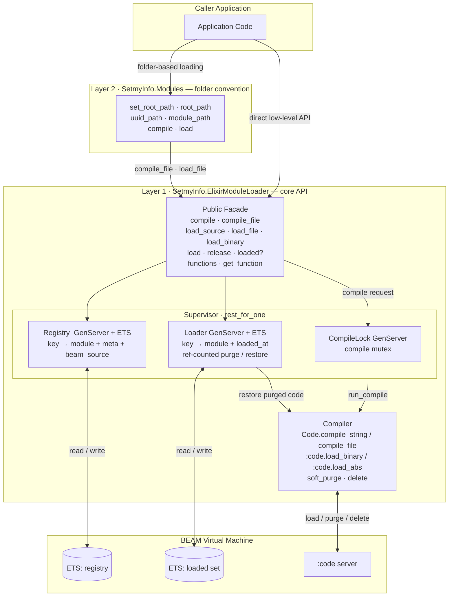

# elixir-module-loader

Dynamic Elixir module compilation, loading, 128-bit-keyed registry, and
lifecycle management as a reusable OTP library.

Compile Elixir source strings or `.ex` / `.beam` files at runtime, register
the resulting modules under cryptographically-random 128-bit keys (as raw
binaries **or** UUID strings), load them into the VM on demand, and release
them — all in a process-safe OTP supervision tree.

## Installation

Add `elixir_module_loader` to your `mix.exs` dependencies:

```elixir
def deps do
  [
    {:elixir_module_loader, "~> 1.1"}
  ]
end
```

## Quick start

```elixir
alias SetmyInfo.ElixirModuleLoader, as: EML

# 1. Compile source — module is immediately loaded, key auto-assigned
{:ok, key, _module} = EML.compile("""
  defmodule SetmyInfo.Demo.Plugin do
    def greet(name), do: "Hello, \#{name}!"
  end
""")

# 2. Discover what functions the module exports (function names may not be
#    known at compile time — they come from external systems)
{:ok, exports} = EML.functions(key)
#=> {:ok, [greet: 1]}

# 3. Capture a function by name and call it with a list of arguments
{:ok, greet_fn} = EML.get_function(key, "greet", 1)
"Hello, World!" = greet_fn.(["World"])

# 4. Release when done — frees the working-set slot and purges code from the VM
:ok = EML.release(key)
```

## Key type

Every registered module is addressed by a 128-bit key. All key-taking
functions accept **either** form interchangeably:

- a **16-byte binary** — `<<_::128>>` from `generate_key/0`
- a **UUID string** — `"550e8400-e29b-41d4-a716-446655440000"` from `generate_uuid/0`

```elixir
key  = EML.generate_key()    # :crypto.strong_rand_bytes(16)
uuid = EML.generate_uuid()   # random UUIDv4 string

# Convert between forms
uuid = EML.key_to_uuid(key)
```

## API reference

All functions live on `SetmyInfo.ElixirModuleLoader`.

### Compilation

| Function | Returns | Description |
|---|---|---|
| `compile(source)` | `{:ok, key, module}` | Compile source string, auto-register, load immediately |
| `compile(source, load: false)` | `{:ok, [{module, binary}]}` | Compile only — no library registration |
| `compile_file(path)` | `{:ok, key, module}` | Compile `.ex` file or load `.beam`, auto-register |
| `compile_file(path, load: false)` | `{:ok, [{module, binary}]}` | Compile `.ex` only — no library registration |

### Loading under caller-provided keys

| Function | Returns | Description |
|---|---|---|
| `load_binary(uuid, module, binary)` | `{:ok, module}` | Register a pre-compiled BEAM binary under caller UUID — no recompilation |
| `load_source(uuid, source)` | `{:ok, module}` | Compile source, register under caller UUID, load |
| `load_file(uuid, path)` | `{:ok, module}` | Compile `.ex` / load `.beam`, register under caller UUID, load |
| `load_by_name(module_atom)` | `{:ok, key, module}` | Register an already-compiled module, auto-assign key |

### Working set

| Function | Returns | Description |
|---|---|---|
| `load(key_or_uuid)` | `{:ok, module}` or `{:error, term}` | Load (or restore) a registered module |
| `release(key_or_uuid)` | `:ok` or `{:error, :not_loaded}` | Remove from working set; purge library-managed code |
| `loaded?(key_or_uuid)` | `boolean` | Check if currently in the working set (lock-free ETS read) |
| `functions(key_or_uuid)` | `{:ok, [{name, arity}]}` or `{:error, term}` | List exported functions; auto-loads the key if not yet loaded |
| `get_function(key_or_uuid, name, arity)` | `{:ok, fun}` or `{:error, :not_found}` | Capture a function by name (atom or string) as a `([args] -> result)` closure |

### Key management

| Function | Returns | Description |
|---|---|---|
| `generate_key()` | `<<_::128>>` | Cryptographically-random 128-bit binary key |
| `generate_uuid()` | `String.t()` | Random version-4 UUID string |
| `key_to_uuid(key)` | `String.t()` | Convert binary key to UUID string |

## No imposed interface

The library does not require loadable modules to implement any callbacks,
expose specific function names, or follow any naming convention. Function
names are not known at compile time — they come from external systems
(databases, configuration, HTTP parameters). The caller discovers them at
runtime using `functions/1` and invokes them via `get_function/3`:

```elixir
# Discover available functions
{:ok, exports} = EML.functions(key)
#=> {:ok, [mask_first_name: 1, mask_last_name: 1]}

# Capture a function whose name came from config or an external system
fn_name = fetch_fn_name_from_db()   # e.g. "mask_first_name"
{:ok, fun} = EML.get_function(key, fn_name, 1)
masked = fun.(["Alice"])             # → "A****"

# Compose with standard Elixir — combine closures at runtime
names = ["Alice", "Bob", "Carol"]
masked_names = Enum.map(names, &fun.([&1]))
```

Alternatively, once the module atom is returned by `load/1`, `apply/3` is
always available for dynamic dispatch by atom name:

```elixir
{:ok, module} = EML.load(key)
apply(module, String.to_existing_atom(fn_name), [arg])
```

## Deferred loading — compile now, load later

The `load: false` option enables a build/pre-compile phase that produces
BEAM binaries without registering them. The caller then decides when to
load each one on demand using `load_source/2` or `load_file/2`.

This pattern scales to millions or billions of UUID-keyed modules on disk
that cannot all be loaded at once:

```elixir
alias SetmyInfo.ElixirModuleLoader, as: EML

# Build phase — compile source ONCE; keep the binary
{:ok, [{module, binary}]} = EML.compile(source, load: false)
# Optionally persist `binary` to a .beam file on disk / cache

# Request phase — load from binary, no recompilation
uuid = EML.generate_uuid()
{:ok, ^module} = EML.load_binary(uuid, module, binary)
# or compile from file on demand:
# {:ok, _} = EML.load_file(uuid, "path/to/plugin.ex")

# Function name comes from the external system — discover at runtime
{:ok, exports} = EML.functions(uuid)               # [{:transform, 1}, ...]
fn_name = get_fn_name_from_config_or_db()          # "transform"
{:ok, fun} = EML.get_function(uuid, fn_name, 1)
result = fun.([data])

# Release phase — free working-set slot and code memory
:ok = EML.release(uuid)
```

## Masking use case

A REST endpoint loads per-request masking modules under UUID keys, masks
PII data, then releases to free memory. Function names arrive from the
external system — the caller never hardcodes them.

```elixir
alias SetmyInfo.ElixirModuleLoader, as: EML

# Input and output data shapes (caller-owned, in SetmyInfo namespace)
defmodule SetmyInfo.Demo.Person,    do: defstruct [:first_name, :last_name]
defmodule SetmyInfo.Demo.PersonDTO, do: defstruct [:first_name, :last_name]

alias SetmyInfo.Demo.{Person, PersonDTO}

# Sources under UUID-named folders on disk (all in SetmyInfo namespace)
first_name_masker_source = """
defmodule SetmyInfo.Masking.FirstNameMasker do
  def mask_first_name(nil), do: nil
  def mask_first_name(""), do: ""
  def mask_first_name(<<first::binary-size(1), rest::binary>>) do
    first <> String.duplicate("*", String.length(rest))
  end
end
"""

last_name_masker_source = """
defmodule SetmyInfo.Masking.LastNameMasker do
  def mask_last_name(nil), do: nil
  def mask_last_name(value) when is_binary(value) do
    String.duplicate("*", String.length(value))
  end
end
"""

# Caller generates UUIDs for each masking module
fn_uuid = EML.generate_uuid()
ln_uuid = EML.generate_uuid()

# Load maskers under their UUIDs
{:ok, _} = EML.load_source(fn_uuid, first_name_masker_source)
{:ok, _} = EML.load_source(ln_uuid, last_name_masker_source)

# Caller discovers function names at runtime (or receives them from config/DB)
{:ok, fn_exports} = EML.functions(fn_uuid)
#=> {:ok, [mask_first_name: 1]}

# Capture functions by name — only the caller knows what functions are present
fn_name = "mask_first_name"   # from external system
ln_name = "mask_last_name"

{:ok, mask_fn} = EML.get_function(fn_uuid, fn_name, 1)
{:ok, mask_ln} = EML.get_function(ln_uuid, ln_name, 1)

# Caller builds the full masking lambda — library is not involved in calling
person = %Person{first_name: "John", last_name: "Doe"}

full_masking_function = fn p ->
  %PersonDTO{
    first_name: mask_fn.([p.first_name]),
    last_name:  mask_ln.([p.last_name])
  }
end

dto = full_masking_function.(person)
#=> %PersonDTO{first_name: "J***", last_name: "***"}

# Release after the request — code purged from VM
:ok = EML.release(fn_uuid)
:ok = EML.release(ln_uuid)
```

See `test/integration/masking_test.exs` for the full runnable version
including the build-phase (compile without loading) pattern
(run with `mix test.integration`).

## SetmyInfo.Modules — folder-based loader

`SetmyInfo.Modules` is a higher-level layer on top of `SetmyInfo.ElixirModuleLoader`
that manages modules stored as files on disk, grouped by UUID-named folders under a
single process-wide **root path**.

### Folder convention

Each UUID maps to a folder containing one Elixir source file and, after compilation,
a corresponding `.beam` file. Both the UUID and the source file name are supplied in a
`%SetmyInfo.Modules.Request{}` struct — the library imposes no naming convention.

```
{root_path}/
  550e8400-e29b-41d4-a716-446655440000/
    Masker.ex                       ← source; file_name in the Request
    Elixir.SetmyInfo.Masking.Masker.beam  ← written by compile/1, read by load/1
```

### Two-phase workflow

Compilation and loading are fully independent steps:

1. **Compile** — translate the `.ex` source to a `.beam` file on disk. Nothing is
   loaded into the VM or registered. This step may happen in a separate process, at
   deploy time, or long before any request arrives. Pre-compiled `.beam` files placed
   in the UUID folder by any external means are equally supported.

2. **Load** — read the `.beam` file from disk, load it into the VM, and register the
   module under the UUID in EML. No recompilation; no in-memory binary passing from
   the compile step.

### Request struct

```elixir
alias SetmyInfo.Modules.Request

request = %Request{uuid: uuid, file_name: "Masker.ex"}
```

Both `:uuid` and `:file_name` are required fields.

### Path helpers

```elixir
alias SetmyInfo.Modules
alias SetmyInfo.Modules.Request

Modules.set_root_path("/var/app/modules")

{:ok, "/var/app/modules/550e8400-..."}           = Modules.uuid_path(uuid)
{:ok, "/var/app/modules/550e8400-.../Masker.ex"} = Modules.module_path(%Request{uuid: uuid, file_name: "Masker.ex"})
```

### Workflow

```elixir
alias SetmyInfo.Modules
alias SetmyInfo.Modules.Request
alias SetmyInfo.ElixirModuleLoader, as: EML

# Once at startup
:ok = Modules.set_root_path("/var/app/modules")

request = %Request{uuid: uuid, file_name: "Masker.ex"}

# Build phase (separate process / deploy time) — compile .ex → .beam on disk
{:ok, [beam_path]} = Modules.compile(request)

# Request phase — load from .beam on disk, no recompilation
{:ok, _module} = Modules.load(request)

# Discover and invoke functions by name (from config / DB)
{:ok, fun} = EML.get_function(uuid, fn_name, 1)
result = fun.([data])

# Release when done
:ok = EML.release(uuid)
```

### Loading a pre-compiled `.beam`

`Modules.load/1` scans the UUID folder for any `.beam` file — it does not require
that `Modules.compile/1` was used to produce it. A `.beam` compiled externally (by
`mix compile`, another service, or a CI pipeline) and placed in the UUID folder works
identically.

See `test/integration/modules_integration_test.exs` for runnable examples
(run with `mix test.integration`).

## Memory management

The library manages code memory for modules it compiled:

- `release/1` removes the key from the loaded working set. When no other
  loaded key uses the same module, the BEAM code is deleted and soft-purged
  from the VM.
- Purging is **reference-counted** — a module shared by multiple keys stays
  in the VM until the last key is released.
- A subsequent `load/1` transparently restores purged code from the stored
  BEAM binary or by recompiling the `.ex` source file. The key remains
  addressable at all times.
- Modules loaded via `load_by_name/1` (externally compiled) are never
  purged — the library does not own code it did not compile.

```elixir
{:ok, _module} = EML.load_source(uuid, source)
{:ok, fun} = EML.get_function(uuid, "transform", 1)
result = fun.([data])
:ok = EML.release(uuid)         # code freed from VM
{:ok, fun} = EML.get_function(uuid, "transform", 1)  # code transparently restored
result2 = fun.([data])
```

## Architecture



**Layer 2** (`SetmyInfo.Modules`) is a thin path-and-convention layer. It provides two
independent steps: `compile/1` translates a `.ex` source to a `.beam` file on disk
(build phase), and `load/1` reads the `.beam` from disk and delegates to Layer 1 to
register the module (request phase). All runtime operations (`get_function`, `release`,
`functions`) go directly through Layer 1 — Layer 2 exposes no duplicated API for them.

**Layer 1** (`SetmyInfo.ElixirModuleLoader`) is the core library and can be used standalone
without Layer 2. The three OTP processes under the supervisor are independent: Registry handles
registration, Loader handles the working set and code lifecycle, and CompileLock serialises
compilation to protect the VM-global compiler flag.

## Supervision tree

```
SetmyInfo.ElixirModuleLoader.Supervisor (rest_for_one)
├── Registry       — ETS-backed 128-bit key → module atom mapping
├── Loader         — GenServer tracking the loaded working set in ETS
└── CompileLock    — serialises compilations (VM-global flag safety)
```

`:rest_for_one` restarts all children that come after the crashed one:

- Registry crash → Loader + CompileLock restart (ETS tables rebuilt)
- Loader crash → Loader + CompileLock restart (working set re-tracked by the user; CompileLock is stateless)
- CompileLock crash → only CompileLock restarts

## Concurrency

| Operation | Guarantee |
|---|---|
| `compile/1,2`, `compile_file/1,2` | Serialised through CompileLock — VM-global flag never toggled by two callers at once |
| `load/1`, `release/1`, `load_binary/3`, `load_source/2`, `load_file/2` | Mutations serialised through Loader GenServer; `load/1` is idempotent across concurrent callers |
| `loaded?/1` | Lock-free O(1) ETS read — safe for any number of concurrent readers |
| `functions/1`, `get_function/3` | Lock-free ETS read when already loaded; one GenServer call on first load |

Two caveats worth knowing:

- **Cold loads are serialised through the Loader.** When a key's code must be
  restored (recompile a `.ex`, reload a `.beam`/binary after a release), the
  restore runs inside the Loader GenServer and may take up to 60 seconds.
  Cold loads of *different* keys do not run in parallel. Already-loaded keys
  are unaffected (lock-free read).
- **Do not use and release the same key from different processes at once.**
  `release/1` can purge a module's code between the moment another process
  obtains the module and the moment it calls a function on it, raising
  `:undef`. Acquire and use a function within a single load → use → release
  lifecycle. Reference counting only protects a module shared across
  *different* keys, not concurrent use-and-release of the *same* key.

## Development commands

```bash
mix build              # deps.get + compile
mix deps.get           # install dependencies
mix compile            # compile all source files
mix format             # format source files
mix validate           # compile --warnings-as-errors + format check
mix test.unit          # unit tests
mix test.integration   # integration tests
mix test.e2e           # e2e + Gherkin BDD tests
mix test.gherkin       # Gherkin/Cucumber only
mix test.all           # all tests
mix test.coverage      # ExCoveralls HTML report → _build/cover/
mix audit              # dependency vulnerability scan (mix_audit)
mix security           # static security analysis (sobelow)
mix docs               # ExDoc HTML → _build/doc/
mix report             # docs + test.coverage + deps.audit
```

---

## Publishing to hex.pm

### Prerequisites

- Elixir 1.17+ and Mix installed
- A hex.pm account (free) at https://hex.pm/signup
- `hex` Mix task: `mix local.hex --force`

### 1 — Create account and authenticate

```bash
mix hex.user register   # new account (one-time)
mix hex.user auth       # authenticate on a new machine
```

### 2 — Verify package metadata in mix.exs

```elixir
defp package do
  [
    name: "elixir_module_loader",
    licenses: ["MIT"],
    links: %{"GitHub" => "https://github.com/setmy-info/elixir-module-loader"},
    maintainers: ["Imre Tabur"],
    files: ~w(lib .formatter.exs mix.exs README.md LICENSE)
  ]
end
```

### 3 — Dry-run (preview only)

```bash
mix hex.publish --dry-run
```

### 4 — Publish

```bash
mix hex.publish
# or with an API key:
HEX_API_KEY=<your-key> mix hex.publish --yes
```

After publish the package is live at:
- https://hex.pm/packages/elixir_module_loader
- https://hexdocs.pm/elixir_module_loader

### 5 — Publish a new version

1. Bump `version` in `mix.exs`.
2. Update this README if the public API changed.
3. Run `mix hex.publish`.

### 6 — CI auto-publish (GitHub Actions)

Add `HEX_API_KEY` as a repository secret (Settings → Secrets → Actions),
then the publish job in `.github/workflows/ci.yml` runs automatically on
pushes to master.

---

## License

MIT — see [LICENSE](LICENSE).
